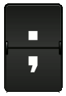

# Digital Split-Flap Board

A web-based split-flap display board simulator that mimics the classic train station departure boards. Enter text and watch it flip-flap into place with authentic sound effects!

## Features

- **Authentic Animation**: Characters flip through letters just like real split-flap displays
- **Sound Effects**: Realistic flapping sounds accompany each character change
- **Full Character Set**: Supports A-Z, 0-9, and special characters (!@#-.:;/)
- **Responsive Design**: Works on desktop and mobile devices
- **Simple Interface**: Just type your message and click display

## How to Use

1. Open `index.html` in your web browser
2. Type your message in the input field (up to 20 characters)
3. Click the "Display" button or press Enter
4. Watch your message flip into place!

You can toggle sound effects on/off using the checkbox at the bottom.

## Supported Characters

- **Letters**: A-Z (automatically converted to uppercase)
- **Numbers**: 0-9
- **Special Characters**:
  - Space (blank)
  - ! (exclamation/bang)
  - @ (at sign)
  - # (hashtag)
  - - (hyphen)
  - . (period)
  - : (colon)
  - ; (semicolon)
  - / (slash)

## Files

- `index.html` - Main HTML structure
- `style.css` - Styling and animations
- `script.js` - Flip animation logic
- `OatFoundry.mp3` - Flap sound effect
- Character images (A.png, B.png, etc.) - Individual character graphics

## Technical Details

The split-flap effect is achieved using:
- CSS animations for the flipping motion
- JavaScript for sequencing and timing
- Individual character images for authentic appearance
- Audio playback synchronized with each flip

Each character animates sequentially with a 200ms delay, creating the classic cascading effect of a real split-flap board.

## Credits

Character images and sound effects from the original split-flap board project.

## License

See LICENSE file for details.
